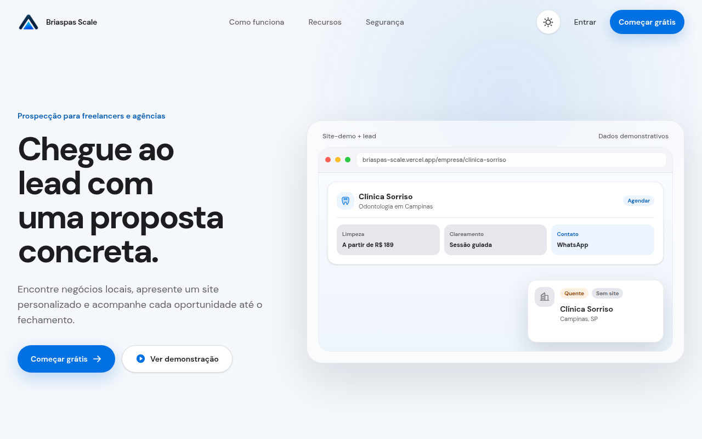
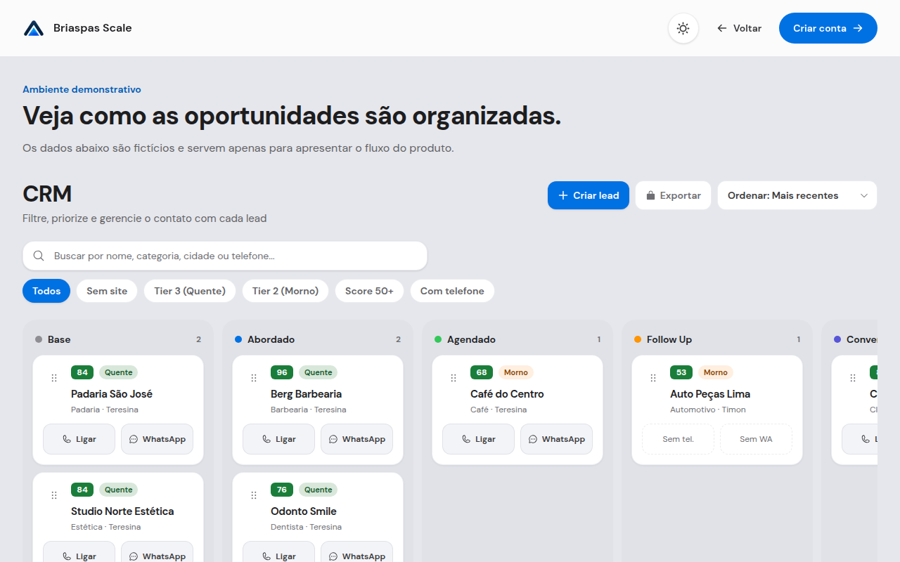
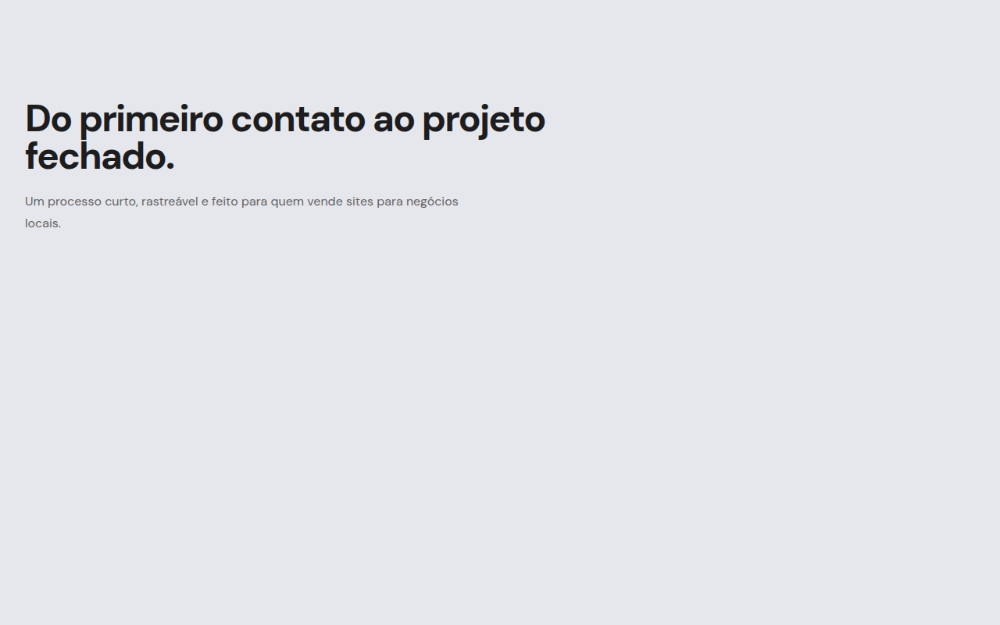
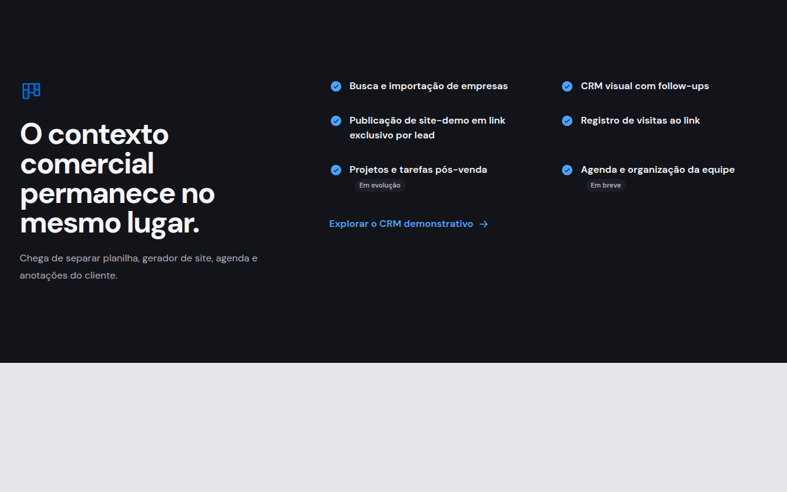

# Briaspas Scale

Portfólio de produto — CRM de prospecção para negócios locais.

**Autor:** Wesley Luther

## Problema

Equipes que vendem sites e serviços para empresas locais costumam espalhar o trabalho entre planilhas, ferramentas de geração de página, anotações soltas e follow-ups no WhatsApp. O contexto do lead se perde, a proposta demora a sair e o funil fica difícil de acompanhar.

O **Briaspas Scale** concentra busca/importação de empresas, geração de **site-demo por lead**, CRM visual e publicação em link exclusivo — do primeiro contato até o projeto vendido, com dados isolados por workspace.

## Demonstração

**Produção:** https://briaspas-scale.vercel.app

Ambiente público com **dados demonstrativos** (sem leads reais). Explore a landing, o CRM em `/demonstracao` e o fluxo descrito abaixo.

| Visão | Captura |
| --- | --- |
| Hero e proposta de valor |  |
| CRM demonstrativo (kanban) |  |
| Jornada comercial |  |
| Recursos do produto |  |

## O que já funciona

| Recurso | Status |
| --- | --- |
| Login, cadastro e recuperação de senha (Supabase Auth) | Disponível |
| Busca/importação de leads (Foursquare, CSV, manual) | Disponível |
| CRM visual, scores e follow-ups | Disponível |
| Geração, revisão e publicação de site-demo (`/empresa/[slug]`) | Disponível |
| Prévia privada antes de publicar | Disponível |
| Registro de visitas ao link do site | Disponível |
| **Projetos** e tarefas pós-venda | **Em evolução** |
| **Agenda** e organização da equipe | **Em evolução / em breve** |
| Integração **WhatsApp / Meta** oficial | **Adiado** (UI preparada; API oficial não conectada) |

Documentação operacional: [`docs/importacao-de-leads.md`](./docs/importacao-de-leads.md), [`docs/geracao-de-sites.md`](./docs/geracao-de-sites.md), [`docs/modelo-completo-do-lead.md`](./docs/modelo-completo-do-lead.md).

## Stack

- **Next.js 16** (App Router)
- **React 19**
- **TypeScript**
- **Tailwind CSS 4**
- **Supabase** — Auth, Postgres e **RLS** por workspace
- **Vercel** — hospedagem de produção

Desenvolvimento com Turbopack; build de produção com Webpack (`npm run build`).

## Decisões técnicas (segurança)

- **Upload de site em ZIP:** limites de tamanho (arquivo e descompactado), número máximo de arquivos, lista fechada de extensões, exigência de `index.html` na raiz, detecção de **zip bomb** (taxa de compressão e tamanhos validados com `yauzl`) e bloqueio de **path traversal** (`..`, barras absolutas, extensões não permitidas). Ver [`src/lib/sites/uploaded-site-zip.ts`](./src/lib/sites/uploaded-site-zip.ts) e [`docs/geracao-de-sites.md`](./docs/geracao-de-sites.md).
- **Prévia privada:** token aleatório com hash SHA-256 armazenado no banco, expiração (~30 min) e cookie de escopo por slug; comparação em tempo constante. Ver [`src/lib/sites/site-preview-token.ts`](./src/lib/sites/site-preview-token.ts).
- **HTML gerado por IA:** sanitização com allowlist (`sanitize-html`) antes de persistir ou servir.
- **Isolamento por workspace:** consultas autenticadas amarradas ao `workspace_id` do membro; políticas RLS no Supabase (auditoria em [`docs/auditoria-rls.sql`](./docs/auditoria-rls.sql)).
- **Segredos:** chaves de provedor só em variáveis de ambiente do servidor; script `npm run security:secrets` impede vazamento no bundle cliente.

## Executar localmente

```bash
npm install
npm run dev
```

Abra http://localhost:3000.

Configure `.env.local` a partir de [`.env.example`](./.env.example):

```env
NEXT_PUBLIC_SUPABASE_URL=https://seu-projeto.supabase.co
NEXT_PUBLIC_SUPABASE_PUBLISHABLE_KEY=sb_publishable_sua-chave
```

Use apenas a chave **publicável** — nunca `service_role` no cliente. Esquema e migrations: [`supabase/README.md`](./supabase/README.md). Deploy: [`docs/deploy-vercel.md`](./docs/deploy-vercel.md).

O hook `commit-msg` (via `npm run hooks:install`) remove trailers `Co-authored-by` de agentes automaticamente.

## Testes

```bash
npm test              # Vitest — sanitização, ZIP, tokens de prévia, templates, rate limit
npm run test:e2e      # Playwright — páginas públicas
npm run lint
npm run typecheck
npm run build
```

Tudo junto: **`npm run check`** (lint, typecheck, testes unitários e verificação de segredos).

## Próximos passos (roadmap — não implementados)

| Item | Descrição |
| --- | --- |
| **T7** | Galeria opcional de sites-demo na landing |
| **T8** | Mensagem de outreach / copy comercial |
| **T9** | Visitas de hot-lead e sinalização no CRM |

Planejamento amplo: [`plans/blueprint-briaspas-scale.md`](./plans/blueprint-briaspas-scale.md) e [`docs/plano-de-evolucao-em-partes.md`](./docs/plano-de-evolucao-em-partes.md).

## Repositório e licença

Código: https://github.com/Asapx380/briaspas-scale

Projeto privado em evolução — use a demonstração pública para avaliar o produto; não inclua dados reais de clientes em issues ou PRs.
